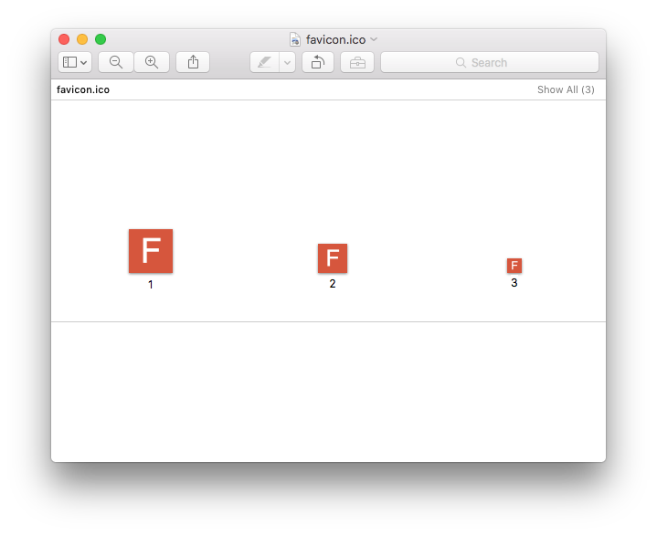

# Favicon.js

Favicon.js is a lightweight library that allows you to create ICO and PNG formatted favicons from a canvas element.

## Usage

### Generate ICO

Generate an ICO file from a `<canvas>` element. Initialize a `Favicon.Ico` object with a canvas element. The canvas should be square for best results. Pass the generate method an array of sizes that the (layered) ICO file should contain.

```JavaScript
const ico = new Favicon.Ico(canvas);
const dataurl = ico.generate([16, 32, 48]);
```

### Generate PNG

Generate a PNG file from a `canvas` element. Initialize a `Favicon.Png` object with a canvas element. The canvas should be square for best results. Pass the generate method the size that should be generated.

```JavaScript
const png = new Favicon.Png(canvas);
const dataurl = png.generate(32);
```

### Generate Package

Generate multiple favicon format based on current best practices. Pass `Favicon.Package` a canvas element and it will return a dictionary of dataurls.

```JavaScript
var package = Favicon.Package(canvas);
```

The package will contain the follow keys which map to common favicon formats.

- `ico` - favicon.ico
- `png16` - favicon-16x16.png
- `png32` - favicon-32x32.png
- `png180` - apple-touch-icon.png
- `png192` - android-chrome-192x192.png
- `png512` - android-chrome-512x512.png

### Example

The example below will generate an ICO formatted favicon that includes 3 sizes: 16x16, 32x32, and 48x48 pixels. The full example can be found [here](./sandbox/ico.html).



```JavaScript
// Setup canvas
const canvas = document.getElementById("canvas");
canvas.width = 128;
canvas.height = 128;
const context = canvas.getContext("2d");

// Draw background
context.fillStyle = "#d85537";
context.fillRect(0, 0, canvas.width, canvas.height);

// Draw text
context.fillStyle = "#FFFFFF";
context.font = "100px Helvetica";
context.textBaseline = "middle";
context.textAlign = "center";
const x = canvas.width / 2;
const y = canvas.height / 2;
context.fillText("F", x, y);

// Create favicon.ico dataurl
const ico = new Favicon.Ico(canvas);
const dataurl = ico.generate([16, 32, 48]);

// Activate the download button
const download = document.getElementById("download");
download.href = dataurl;
download.setAttribute("download", "favicon.ico");
```
